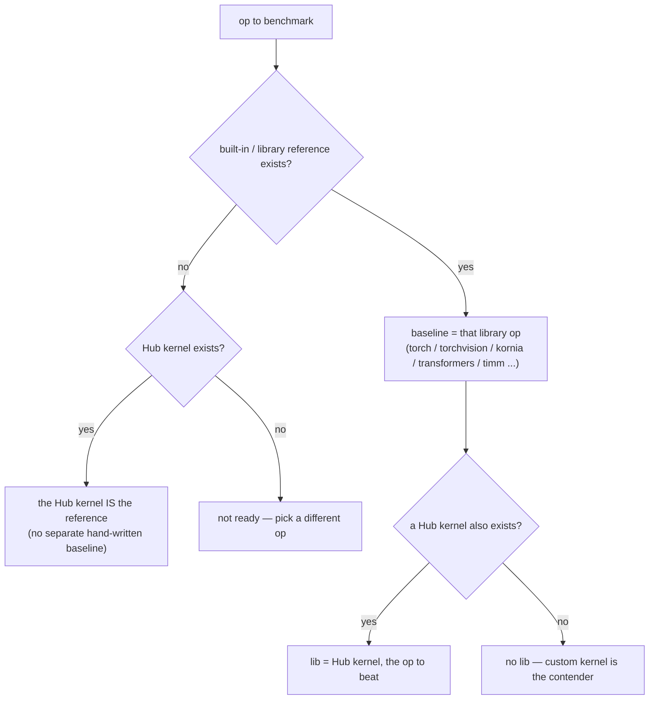

# Setting up baselines

The `baseline` is the eager reference for an op — what makes the eager-vs-`torch.compile` comparison meaningful, and the correctness reference for `lib`/`custom`.

**Hard rule: never hand-write a baseline.** The reference must always be a *real, external* implementation — a function from a library, or a Hub kernel. We do not write our own torch reimplementation of the op and call it the baseline (a reimplementation we author proves nothing about correctness and isn't a meaningful target). If neither a library reference nor a Hub kernel exists for an op, it is not ready to be a benchmark config yet — pick a different op.

Pick the baseline in this order:

1. **A built-in / library reference function** — the canonical op everyone uses, run directly. Examples: `torchvision.ops.nms` (NMS), `kornia.filters.gaussian_blur2d` (Gaussian blur), `transformers`' `apply_rotary_pos_emb` (RoPE) or `LlamaRMSNorm` (RMSNorm), `timm`'s `apply_rot_embed_cat` (vision RoPE). The op *is* the reference — legitimate because it's real upstream code, not something we invented.
2. **Else a Hub kernel** (`kernels-community/...`) — if no library exposes the op but a Hub kernel does, that kernel is the reference. There is no separately authored baseline.
3. **Else** — the op isn't ready to benchmark. Do not hand-roll a torch baseline to fill the gap.

The `lib` is set independently: a Hub kernel (`kernels-community/...`) when one exists for the op, otherwise unset (the custom kernel is then the only contender). When the library reference is itself the op (case 1), `lib` is usually left unset, exactly as `nms` does with `torchvision`.

> `torchvision.ops` (NMS, RoIAlign) and `kornia.filters` (gaussian_blur) are the built-in-op case; `transformers` / `timm` reference functions are the library-reference case.

## Hard rule: `baseline` is *only* the op call

`baseline` must be the bare reference call — ideally **one line** — and nothing else. **All preparation belongs in `inputs()`**, never in `baseline`. The timed path is whatever `baseline` (and `lib`/`custom`) do, so any prep left in `baseline` pollutes the measurement and can trivialize or inflate the result.

Belongs in `inputs()`, not `baseline`:

- **Reshapes, flattens, transposes, `.contiguous()`, dtype/device casts.** Hand the op tensors already in the shape/layout/dtype it wants. (E.g. don't `q.reshape(B*NH, N, HD)` inside `baseline` — return q pre-shaped from `inputs()`, or pass the op the natural shape and let it broadcast.)
- **Anything the real model caches once and reuses.** Position embeddings (RoPE cos/sin), masks, precomputed scales — build them in `inputs()`. They are not the op's per-call work. (E.g. the `primus_3d_rope` config builds the rotary embed via `RotaryEmbeddingCat(...).get_embed()` in `inputs()`; `baseline` is just `apply_rot_embed_cat(q, emb), apply_rot_embed_cat(k, emb)`.)
- **Dead branches / config-specific slicing** that never fire for the chosen inputs. If `rope_channels == head_dim`, drop the `if rope_channels < head_dim:` passthrough entirely — don't carry inert code in the hot path.

Stays in `baseline`: only the op's *distinctive computation* — the work a custom kernel would actually have to reproduce. If you find yourself writing more than the op call plus a trivial unpack of its return, move it to `inputs()`. But never move the op's real work into `inputs()` to make the benchmark look faster — that is the inverse failure (see [correctness](correctness.md)).

Once the baseline is chosen, set its correctness check and `use_compile` — see [correctness](correctness.md).
