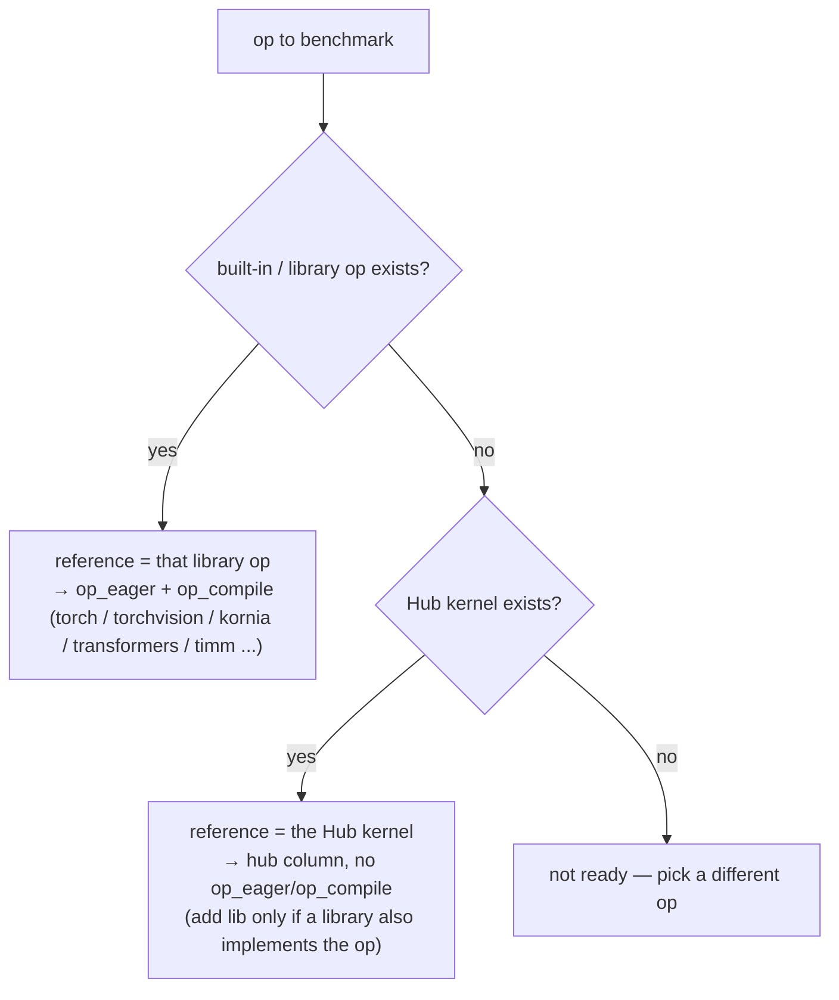

# Setting up baselines

Every config is benchmarked across up to five workloads:

- **`op_eager`** / **`op_compile`** — the *reference*: a real library/built-in op (a composition of PyTorch ops), run eager and under `torch.compile`. This is the correctness ground-truth and the speedup denominator. Only the reference gets the eager/compile split, because it is the only workload `torch.compile` can fuse.
- **`hub`** — an HF Kernel Hub kernel (`kernels-community/...`) for the same op.
- **`lib`** — a separate library implementation of the op: a different optimized library, distinct from the reference.
- **`custom`** — our kernel (`src/kops/...`). Always a contender, never the reference.

`hub`, `lib`, and `custom` are each a single opaque op — one fused kernel behind one call — so they are timed once. `torch.compile` only graph-breaks around an opaque op, so none of them get a compile variant.

**Hard rule: never hand-write the reference.** The reference must always be a *real, external* implementation — a library op or a Hub kernel. We do not write our own torch reimplementation of the op and call it the reference (a reimplementation we author proves nothing about correctness and isn't a meaningful target). If neither a library op nor a Hub kernel exists, the op is not ready to be a benchmark config — pick a different op.

## Choosing the reference

Pick the reference in this order:

1. **A built-in / library op** — the canonical op everyone uses, run directly. Examples: `torchvision.ops.nms` (NMS), `torchvision.ops.roi_align` (RoI Align), `kornia.filters.gaussian_blur2d` (Gaussian blur), `transformers`' `apply_rotary_pos_emb` (RoPE), `timm`'s `apply_rot_embed_cat` (vision RoPE). The op *is* the reference — legitimate because it's real upstream code, not something we invented. It fills `op_eager` / `op_compile`.
2. **Else a Hub kernel** (`kernels-community/...`) — if no library exposes the op but a Hub kernel does, that kernel is the reference. It goes in the **`hub`** column and there is no `op` (`op_eager` / `op_compile` are skipped); the reference's own timing becomes the speedup denominator. Example: `megablocks_moe`, where the megablocks Hub kernel is the reference because there is no clean library MoE op.
3. **Else** — the op isn't ready to benchmark. Do not hand-roll a torch reference to fill the gap.

## Filling the contender columns

The contenders are set independently, each only when it actually exists and differs from the reference:

- **`hub`** — a Hub kernel for the op. When the reference is *already* a library op (case 1), a Hub kernel for the same op goes here as a contender (e.g. `rotary` → `kernels-community/rotary`, `deformable_attention` → `kernels-community/deformable-detr`). When the Hub kernel *is* the reference (case 2), it occupies `hub` as the reference and there is no separate contender.
- **`lib`** — a *second, distinct* library implementation of the op, separate from the reference. Often unset. When the library op is itself the reference (case 1) there is usually no extra `lib`, exactly as `nms` does with `torchvision`.
- **`custom`** — our kernel. Almost always set; it is the kernel the whole benchmark exists to test.

> `torchvision.ops` (NMS, RoI Align) and `kornia.filters` (gaussian_blur) are the built-in-op case; `transformers` / `timm` reference functions are the library-op case; `megablocks` is the Hub-as-reference case.

## Hard rule: the reference is *only* the op call

The reference must be the bare op call — ideally **one line** — and nothing else. **All preparation belongs in `inputs()`**, never in the reference. The timed path is whatever the reference (and `hub` / `lib` / `custom`) do, so any prep left in the reference pollutes the measurement and can trivialize or inflate the result.

Belongs in `inputs()`, not the reference:

- **Reshapes, flattens, transposes, `.contiguous()`, dtype/device casts.** Hand the op tensors already in the shape/layout/dtype it wants. (E.g. don't `q.reshape(B*NH, N, HD)` inside the reference — return q pre-shaped from `inputs()`, or pass the op the natural shape and let it broadcast.)
- **Anything the real model caches once and reuses.** Position embeddings (RoPE cos/sin), masks, precomputed scales — build them in `inputs()`. They are not the op's per-call work. (E.g. the `primus_3d_rope` config builds the rotary embed via `RotaryEmbeddingCat(...).get_embed()` in `inputs()`; the reference is just `apply_rot_embed_cat(q, emb), apply_rot_embed_cat(k, emb)`.)
- **Dead branches / config-specific slicing** that never fire for the chosen inputs. If `rope_channels == head_dim`, drop the `if rope_channels < head_dim:` passthrough entirely — don't carry inert code in the hot path.

Stays in the reference: only the op's *distinctive computation* — the work a custom kernel would actually have to reproduce. If you find yourself writing more than the op call plus a trivial unpack of its return, move it to `inputs()`. But never move the op's real work into `inputs()` to make the benchmark look faster — that is the inverse failure (see [correctness](correctness.md)).

Once the reference is chosen, set its correctness check and `use_compile` — see [correctness](correctness.md).
