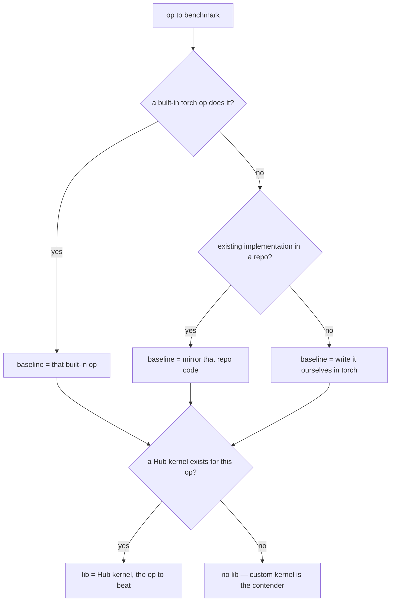

# Setting up baselines

The `baseline` is a native-torch implementation of the op — it's what makes the eager-vs-`torch.compile` comparison meaningful, and the correctness reference for `lib`/`custom`.

Pick the baseline in this order:

1. **Use a built-in torch op** if one does the job — e.g. `torchvision.ops.nms` for NMS. The op *is* the reference.
2. **Else mirror existing code from a repo** — the canonical reference implementation everyone uses (e.g. transformers' `apply_rotary_pos_emb` for RoPE, `LlamaRMSNorm` for RMSNorm). Legitimate because it's real upstream code, not something we invented.
3. **Else write the whole thing in torch ourselves** — a faithful native-torch implementation used purely as the baseline.

The `lib` is set independently: a Hub kernel (`kernels-community/...`) when one exists for the op, otherwise unset (the custom kernel is then the only contender).

> `torchvision.ops` is our example of the built-in-op case (NMS today, RoIAlign and other torchvision ops as future issues).

